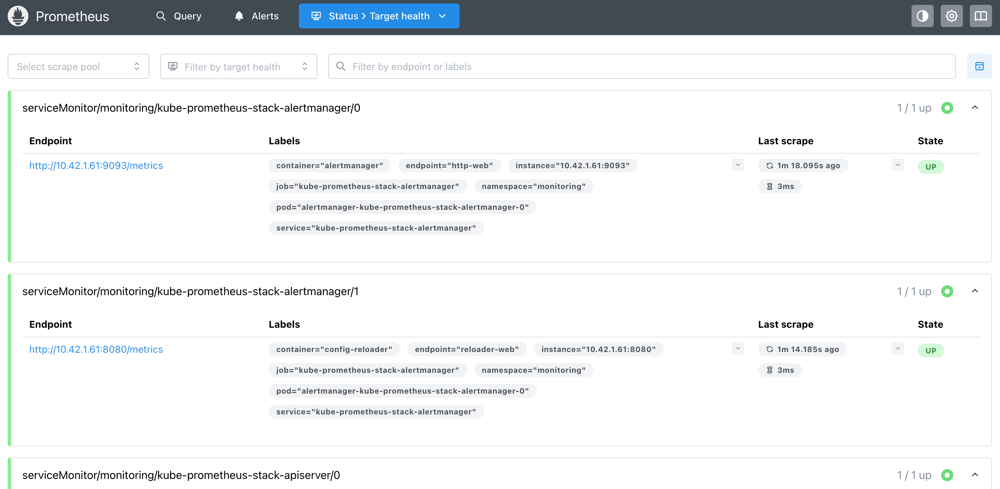
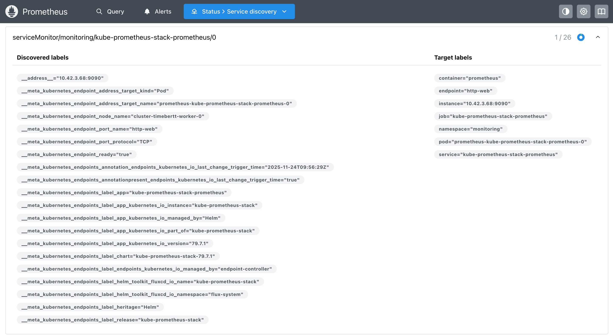
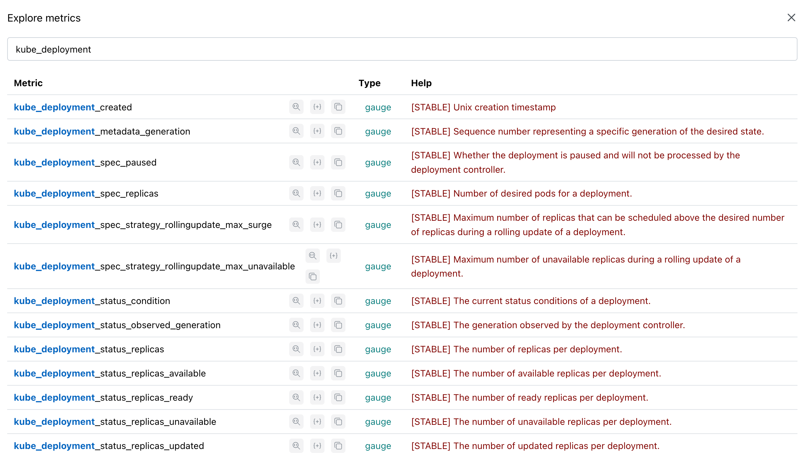
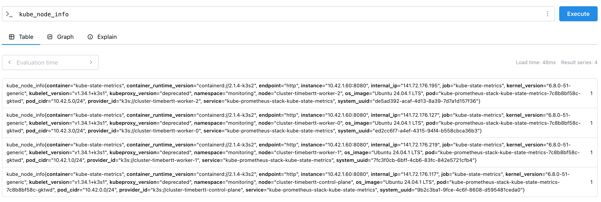
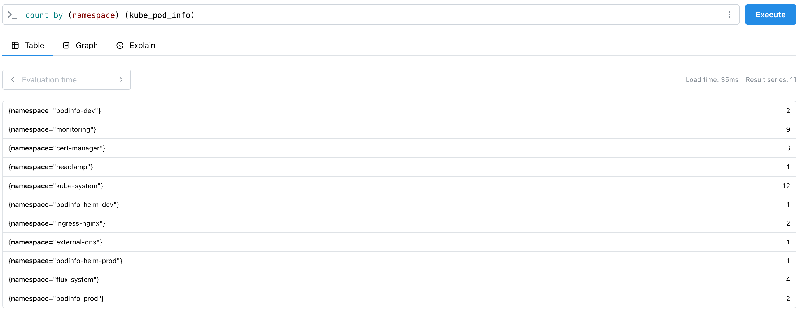
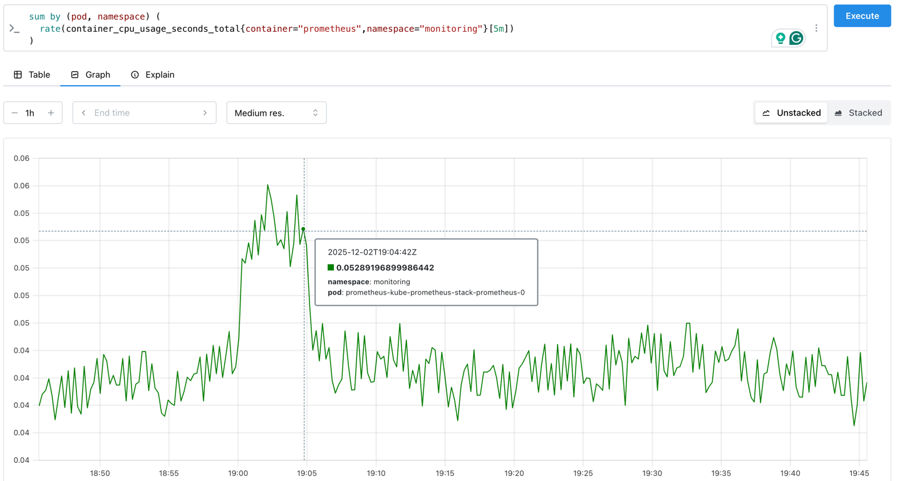
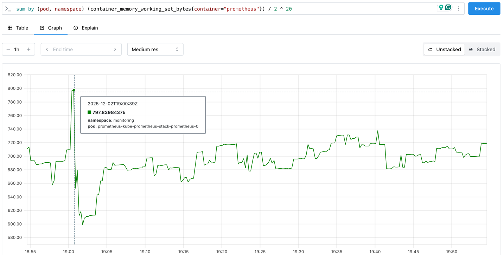

# Lab: Prometheus

[Task Description](https://talks.timebertt.dev/platform-engineering/#/lab-prometheus)

## The Prometheus Web UI

With the [previous lab](kube-prometheus-stack.md), we have installed the kube-prometheus-stack Helm chart, which includes Prometheus.
We configured an ingress resource to access the Prometheus web UI.
Determine the URL to access the Prometheus web UI by checking the ingress resource in the `monitoring` namespace and open it in your web browser.

```bash
$ kubectl -n monitoring get ing
NAME                               CLASS   HOSTS                                             ADDRESS                                        PORTS     AGE
kube-prometheus-stack-grafana      nginx   grafana.<cluster-name>.dski23a.timebertt.dev      141.72.176.127,141.72.176.195,141.72.176.219   80, 443   8d
kube-prometheus-stack-prometheus   nginx   prometheus.<cluster-name>.dski23a.timebertt.dev   141.72.176.127,141.72.176.195,141.72.176.219   80, 443   8d
```

## Targets

The status page of Prometheus should list a set of pre-configured scrape targets, including the Kubernetes API server, kube-state-metrics, kubelets, node-exporter, etc.
All targets should be healthy (state `UP`).
Some jobs don't show any active targets because the corresponding components are not exposed for scraping by the k3s distribution (e.g., kube-controller-manager, etcd).



## Service Discovery

The service discovery page displays how Prometheus discovered these targets via the Kubernetes API in your cluster.
For each target, the service discovery page shows the original labels retrieved from the Kubernetes API and the final labels used by Prometheus for scraping.



## Metrics Explorer

On the query page, you can explore the collected metrics by pressing the "Query Options" button (three horizontal dots) and selecting "Explore Metrics".
The metrics explorer allows you to search for available metrics and view their metrics types and help descriptions.



## Queries

### List the Nodes in the Cluster

kube-state-metrics exports the `kube_node_info` metric for each `Node` object in the cluster.
The value of this metric is always `1`, and it includes labels which contain information about the nodes in the cluster, e.g., the node name, kernel version, OS image, etc.

```text
kube_node_info
```



## Count the Number of Pods per Namespace

Similarly to the `kube_node_info` metric, kube-state-metrics exports the `kube_pod_info` metric for each `Pod` object in the cluster.
The value of this metric is always `1`, and it includes labels which contain information about the pods in the cluster, e.g., the pod name, namespace, pod IP, etc.

For counting the number of pods per namespace, we can use the `count` aggregation operator in PromQL along with the `by` clause to group the results by the `namespace` label:

```text
count by (namespace) (kube_pod_info)
```



## Container CPU Usage

For determining the CPU and memory usage of a specific container, we can use the `container_cpu_usage_seconds_total` and `container_memory_working_set_bytes` metrics provided by the cAdvisor component of kubelet.
The metrics are based on the kernel's cgroup subsystem tracking resource usage of individual containers.
The cAdvisor metrics add labels such as `pod`, `namespace`, and `container` to the kernel's usage information so that we can identify containers by pod and namespace.

The metrics should provide similar values as the output of the `kubectl top pods -n monitoring` command, which retrieves the current CPU and memory usage of pods via the Kubernetes Metrics Server.

```bash
$ kubectl top pods -n monitoring
NAME                                                        CPU(cores)   MEMORY(bytes)
alertmanager-kube-prometheus-stack-alertmanager-0           1m           35Mi
kube-prometheus-stack-grafana-0                             3m           294Mi
kube-prometheus-stack-kube-state-metrics-7c8b8bf58c-gktwd   2m           19Mi
kube-prometheus-stack-operator-5f55ccfd6f-l7nbw             3m           23Mi
kube-prometheus-stack-prometheus-node-exporter-d6zw9        1m           9Mi
kube-prometheus-stack-prometheus-node-exporter-qc9xz        2m           10Mi
kube-prometheus-stack-prometheus-node-exporter-s76pq        1m           10Mi
kube-prometheus-stack-prometheus-node-exporter-ws48z        2m           10Mi
prometheus-kube-prometheus-stack-prometheus-0               42m          725Mi
```

The `container_cpu_usage_seconds_total` metric is a cumulative counter that represents the total CPU time consumed by a container in seconds.
E.g., a value of `2` means that the container has used 2 CPU-seconds since it started.
This could be 2 seconds on a single CPU core or 1 second on 2 CPU cores, etc.

To calculate the CPU usage at a specific point in time, we need to compute the rate of change of this counter over a defined time window.
E.g., if the counter increased by `15` over 1 minute, the container consumed roughly 25% of a single CPU core during that minute (15 CPU-seconds / 60 seconds = 0.25 CPU cores).

To calculate the CPU usage of the `prometheus` container in the `monitoring` namespace, we can use the `rate` function in PromQL to compute the per-second average rate of increase of the `container_cpu_usage_seconds_total` metric based on the last 5 minutes of data.
Show the CPU and memory usage of the `prometheus` container in the `monitoring` namespace over the last hour. Verify your results by comparing them to the output of `kubectl top pods -n monitoring`.

```text
sum by (pod, namespace) (
  rate(container_cpu_usage_seconds_total{container="prometheus",namespace="monitoring"}[5m])
)
```

Visualizing the query over 1 hour in the graph view should show a line chart similar to the following.
This graph shows that at the selected point in time, the Prometheus container was using roughly 5.3% of a single CPU core (53 millicores).



## Container Memory Usage

The `container_memory_working_set_bytes` metric represents the current memory usage of a container in bytes.
In comparison to the `container_memory_usage_bytes` metric, it only includes memory that is actively used by the container and excludes cached memory that can be reclaimed by the system if needed (e.g., file system cache).
To show the memory usage of the `prometheus` container in the `monitoring` namespace in gigabytes, we can use the `container_memory_working_set_bytes` metric and divide the result by $2^{20}$ (1 MiB = $2^{20}$ bytes):

```text
sum by (pod, namespace) (container_memory_working_set_bytes{container="prometheus"}) / 2 ^ 20
```

Visualizing the query over 1 hour in the graph view should show a line chart similar to the following.
This graph shows that at the selected point in time, the memory usage of the Prometheus container was peaking at roughly 800 MiB.


